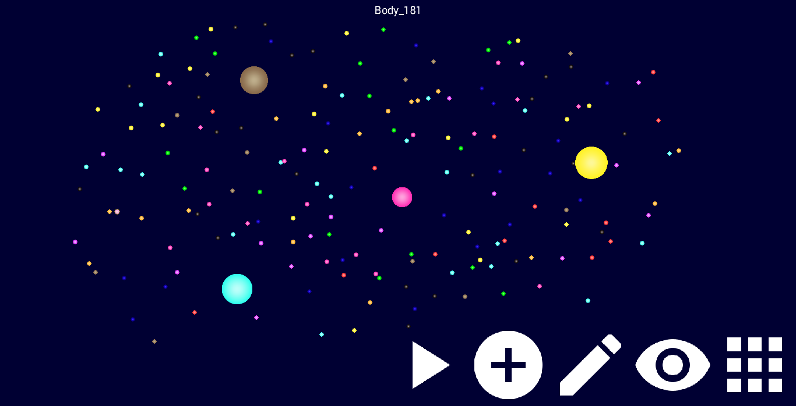
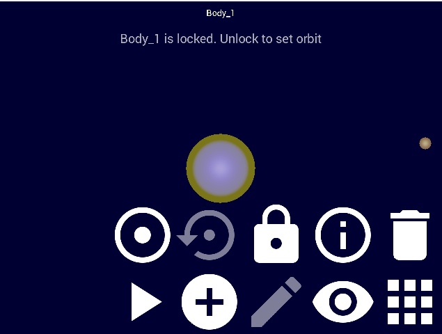
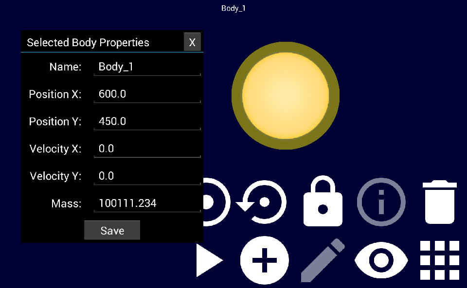

This is a libGDX app made for a Freshmen Design Project at Drexel University.

#### Please see [**OUR REPORT**](Orbit_Simulator_Report.pdf) for more information.

Google Play listing:

# OrbitSimulator

**Explore the physics of gravity in space!**

Features:

- Create unlimited planetary bodies of various sizes
- Observe realistic gravity between planets, moons, and suns
- Drag back to launch planetary bodies across your solar system
- Lock bodies in place and automatically create simple orbits around them
- Manually edit position, velocity, and mass of bodies for specific and/or advanced simulations
- No boundaries

Great for:
- Physics students wanting to better understand gravity in space
- Teachers looking for a fun way to teach students
- Casual play and entertainment

